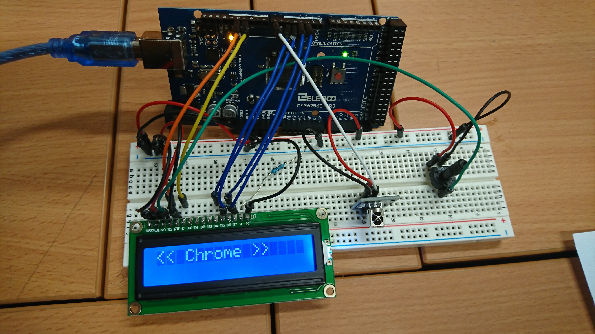

Lanceur de programme ARDUINO IR
===============================

Le programme C doit être lancé avec en argument le fichier du port série

`./a.out /dev/ttyACM0` par exemple.

Le fichier  doit être  lisible et écrivable.   La connexion  doit être
proprement  configurée  avant le  lancement,  par  exemple en  lancant
auparavant le moniteur série de l'IDE arduino.

Les branchements  sont les suivants :

- La ligne  + du bread  board est connectée à la sortie 5V de l'arduino, la ligne - à la masse.
- LCD: 
	- RSS et RW -> Masse
	- RDD -> 5V
	- RS et E -> Broche 12 et 11 de l'arduino
	- A et K sont pour le rétro éclairage, donc il faut les brancher sur la ligne 5V et masse, avec une résistance du coté de l'anode (A), 300 ohm environ.
	- D7 à D4 -> 2 à 5 sur l'arduino
	- VO controle le contraste de l'écran, pour le varier manuellement:
	  - Résistance variable de 10k ohm branchée sur 5+/masse avec la sortie sur la broche VO
- Capteur IR:
  - G et R sur 5V et masse respectivement
  - Y sur la broche 7 de l'arduino

Chenillard
==========

Les leds sont branchées sur les broches 9 à 13 et le potentiomètre sur A0
